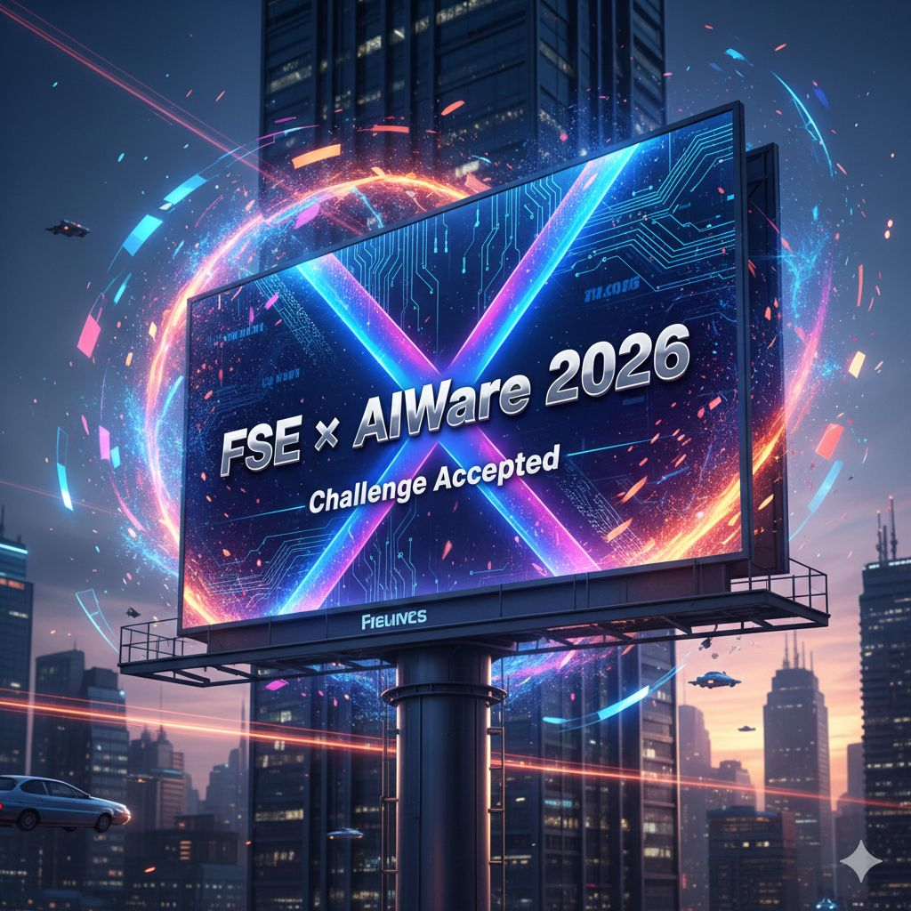

# Agentic Based Python Dependency Resolution


## Abstract
The first annual Agentic-based Python Dependency Resolution challenge, to be held at FSE 2026, invites researchers and practitioners to develop innovative agentic-based systems for automatically resolving complex Python dependency conflicts.
The competition emphasizes open-source innovative memory constrained techniques, such as LLM fine-tuning, retrieval-augmented generation, graph-based databases, error log analysis, and prompt engineering. With open attendance and paper submissions appearing in ACM Digital Library, this event addresses the timely challenge of dependency management in modern Python ecosystems, fostering community collaboration and establishing best practices for LLM-based package management tools.

[FSE-AIWare](https://conf.researchr.org/committee/fse-2026/fse-2026-aiware-2026-competition-program-committee)




## Overview
Agentic engineering has advanced wildly over recent years. Since Chat GPT3.5 took the spotlight back in 2022, we've seen frontier models frequently push the boundaries of what we thought possible.

This inaugural competition seeks to advance agentic approaches for Python dependency resolution. By building upon the work of Bartlett et al. [2025](https://arxiv.org/abs/2501.16191), we encourage researchers to focus on open-source memory constrained techniques, such as innovation in RAG, multi-agent systems, graph-based databases, few-shot learning, and build feedback optimization.

Dependency conflicts remain a daily challenge due to an ever increasing module library, combined with Python use adoption (Jia et al. [2024](https://ieeexplore.ieee.org/document/10684593)). This competition recognises agentic engineering as a possible solution to this problem.

Therefore, we invite practitioners from both Academia and Industry to submit their tools and papers to help advance this field further.

## Competition Workshop

Selected papers will be presented during the conference, at least one author must be registered to present the work. We will also present the tool competition results after verifying each tool against a heldout dataset.

## Paper
Paper submissions are short single-blind papers (max 4 pages including references), following the FSE paper format [guidelines](https://conf.researchr.org/track/fse-2026/fse-2026-research-papers#Call-for-Papers). See [Submissions](#submissions) below.

Papers should describe their approach and evaluate using PLLM as a baseline, using the HG2.9K dataset from Horton and Parnin [2018](https://arxiv.org/abs/1808.04919) (see Tools subsection).

## Submissions
 - **Paper**: Please submit papers directly to *Antony Bartlett* <a.j.bartlett@tudelft.nl>

 - **Code**: We ask competitors to submit code via the process outlined in the [Code Submissions](#code-submissions) section.

## Tools

### Baseline System Overview
In this repository, we have supplied the PLLM tool to serve as a reference point. This tool implements a RAG pipeline and guided prompting to search for working dependencies. The field of Agentic engineering has evolved rapidly since the initial conception of PLLM, leaving great scope for advancement.

Participants are envouraged to build upon and improve the baseline approach; [PLLM]() (5-stage RAG+LLM pipeline): extract dependencies → Docker build → error log analysis → generate specs → validate → iterate.

### Dataset
HG2.9K (2,900+ Python files with hard conflicts). **Constraints**: Docker environment, 10GB VRAM limit. Independent evaluation on held-out dataset for final tool results during the event.

### Training Data
All data from the original PLLM experiment is available:
 - pllm_results
 - pyego-results
 - readpy-results

These folders contain information on working Python versions that could be extracted and used for your approach.

### Evaluation Metrics
- **Success Rate**: Number of successfully resolved files
- **Efficiency**: Time taken to resolve the new dataset
- **Computational Cost**: Time/resources (10GB VRAM limit)
- **Generalization**: Performance on held-out conflicts

#### Code Submissions
We ask competitors to adhere to the following guidelines.
- Fork this repo
- Create a new folder for your tool in the tools folder
- Tools must run within a Docker container (in the spirit of dependency management, please ensure Python and module versions are pinned)
- 10GB VRAM operational constraint (Models should fit within this limit)
- Tools must accept either a folder containing all 'snippets' or one snippet a time (see PLLM setup for more information)
- Submit a [Fork Pull Request](https://docs.github.com/en/pull-requests/collaborating-with-pull-requests/proposing-changes-to-your-work-with-pull-requests/creating-a-pull-request-from-a-fork) no later than the competition [deadline](#important-dates)

Each tool is expected to generate a 'fix' for each snippet in the hard-gists dataset. Note, not every snippet has a possible fix, due to OS and system level dependency constraints.

Final tool results will be presented during the event, where tools will be further evaluated on a held-out dataset. Participation is **open to all FSE 2026 attendees**.

### Important Dates
All deadlines are Anywhere on Earth (AoE):
 - **Competition Announcement**: January 1, 2026
 - **Paper Submission Deadline**: March 6, 2026
 - **Notification to Authors**: March 26, 2026
 - **Participants Camera Ready**: March 31, 2026
 - **Camera-Ready Deadline**: April 2, 2026
 - **Organizers Report Camera Ready**: April 9, 2026
 - **Competition Date**: July 6, 2026

### Program Committee
 - Antony Bartlett (Delft University of Technology)
 - Annibale Panichella (Delft University of Technology)
 - Cynthia Liem (Delft University of Technology)
 - TBA
 - ...

## Getting Started

### Dependencies
 - Install Ollama (https://ollama.com/)
 - Download Gemma2 through Ollama (e.g. ollama pull gemma2)
 - Start the Ollama server
 - Extract hard-gists.tar.gz

To begin, we suggest building the PLLM docker container and running the sample gists to understand how existing works have tackled this problem.

We provide a build script which has been validated on OSX (ARM) and Debian 22.

```cd tools/pllm && build.sh```

```echo "USER=$(whoami)" >> .env && echo "UID=$(id -u)" >> .env && echo "GID=$(id -g)" >> .env && echo "DOCKER_GID=$(stat -c '%g' /var/run/docker.sock)" >> .env```

```docker compose up -d```

**NOTE**: If not using docker compose and Ollama is also dockerized, both containers must be on the same docker network and the -b parameter below should substitute 'host.docker.internal' for the Ollama container name (e.g. ollama), such that the string becomes ''http://ollama:11434'.

The docker compose should bring up the 'pllm-test' docker container. To use the container, we provide the following parameters.

```docker exec -it pllm-test python test_executor.py -f '/gists/0a2ac74d800a2eff9540/snippet.py' -m 'gemma2' -b 'http://host.docker.internal:11434' -l 10 -r 0```

- **-f | --file** - The location of the snippet to validate.
- **-m | --model** - The name of the model to use (must be downloaded with Ollama).
- **-b | --base** - The url to ollama, defaults to http://localhost:11434. Can be different if run in a container.
- **-t | --temp** - The model temp, defaults to 0.7 and used to give the model more freedom and expression in its response.
- **-l | --loop** - How many times we will loop to find a solution.
- **-r | --range** - The search range. Defaults to 0 where it only runs against one python version. If 1 is given then the range is 1 either side of the LLMs found version. For example: If the LLM chooses 3.6 and we have a range of 1 then we will have test runs on python [3.5, 3.6, 3.7].
- **-v | Verbose** logging of information.

## Q&A
Use [GitHub Discussions](https://github.com/checkdgt/fse-aiware-python-dependencies/discussions) for any kind of questions related to the tool competition.

> Do not hesitate to ask questions.
> If something is unclear then it is likely it is unclear for others as well.
> We appreciate all kind of feedback to make this competition platform as usable as possible.

## License
```{text}
FSE-AIWare - Python Dependency Competition Platform
Copyright (C) 2025  Antony Bartlett

This program is free software: you can redistribute it and/or modify
it under the terms of the GNU General Public License as published by
the Free Software Foundation, either version 3 of the License, or
(at your option) any later version.

This program is distributed in the hope that it will be useful,
but WITHOUT ANY WARRANTY; without even the implied warranty of
MERCHANTABILITY or FITNESS FOR A PARTICULAR PURPOSE.  See the
GNU General Public License for more details.

You should have received a copy of the GNU General Public License
along with this program.  If not, see <https://www.gnu.org/licenses/>.
```
[GPLv3](LICENSE)

## Contacts
- Responsible for the repository: [Antony Bartlett](https://www.codegonewild.com)
